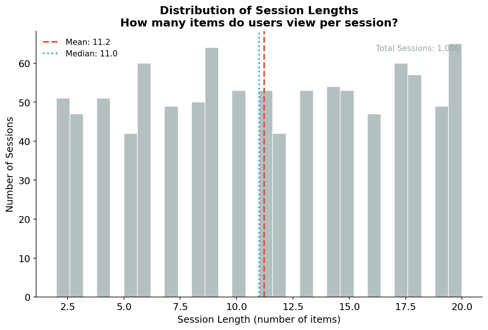
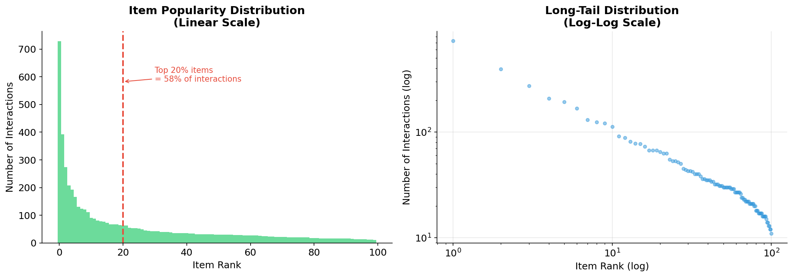

# GRU4Rec Reproduction and Audit

> **Reproducible evaluation harness around the official GRU4Rec implementation for session-based recommendations**

[](https://github.com/oscgonz19/gru4rec-reproduction-and-audit/actions)
[](https://www.python.org/downloads/)
[](https://opensource.org/licenses/MIT)
[](https://pytorch.org/)

---

## What This Is (and What It Isn't)

**This is**: A reproducibility harness and baseline comparison framework around GRU4Rec.

**This is NOT**: A reimplementation or fork of GRU4Rec. The model code is **not included** in this repository.

### My Contributions

- Automated pipeline (`Makefile` + scripts) for reproducible experiments
- Synthetic data generator for CI/testing without licensing issues
- Temporal train/test split without data leakage
- Production-ready baselines: Popularity and First-order Markov Chain
- Evaluation module with Recall@K, MRR@K, NDCG@K
- **11 publication-quality visualizations** for storytelling
- Bilingual documentation (10 documents in EN/ES)
- GitHub Actions CI workflow

### GRU4Rec Model

The official GRU4Rec PyTorch implementation by [Balazs Hidasi](https://github.com/hidasib/GRU4Rec_PyTorch_Official) is **fetched on-demand** to a gitignored `vendor/` directory. It is NOT redistributed.

> **License note**: Official GRU4Rec is free for research/education; contact the author for commercial use.

---

## The Problem We Solve

<p align="center">
  
</p>

**70-80% of e-commerce visitors are anonymous.** Traditional recommendation systems fail because they require user history. Session-based recommendations solve this by predicting the next item based only on the current browsing session.

<p align="center">
  
</p>

---

## GRU4Rec Architecture

<p align="center">
  
</p>

**GRU4Rec** uses Gated Recurrent Units to learn sequential patterns in browsing behavior:

| Aspect | Detail |
|--------|--------|
| **Paper** | "Session-based Recommendations with RNNs" (ICLR 2016) |
| **Citations** | 1,500+ in academic literature |
| **Author** | Balazs Hidasi (Gravity R&D) |
| **Adoption** | Used in production by major e-commerce platforms |

---

## Pipeline Overview

<p align="center">
  
</p>

```bash
# Complete demo in 30 seconds
make fetch        # Clone official GRU4Rec (not redistributed)
make synth_data   # Generate synthetic data
make preprocess   # Temporal split without data leakage
make baselines    # Run Popularity + Markov baselines
make visualize    # Generate all figures
```

---

## Results

<p align="center">
  
</p>

### Performance Metrics

<p align="center">
  
</p>

<p align="center">
  
</p>

### Training Progress

<p align="center">
  
</p>

---

## Data Exploration

<p align="center">
  
</p>

<p align="center">
  
</p>

---

## Evaluation Protocol

<p align="center">
  
</p>

We use **full ranking** (score ALL items), not sampled negatives:

| Evaluation Type | Typical Recall@20 | Reality |
|-----------------|-------------------|---------|
| Sampled (100 neg) | ~80% | **Inflated 2-3x** |
| Full ranking | ~35% | **Realistic** |

---

## Documentation / Documentacion

| Document | English | Espanol | Audience |
|----------|---------|---------|----------|
| **Case Study** | [case_study.md](docs/en/case_study.md) | [case_study.md](docs/es/case_study.md) | Portfolio |
| **Executive Summary** | [executive_summary.md](docs/en/executive_summary.md) | [executive_summary.md](docs/es/executive_summary.md) | Managers |
| **Technical Report** | [technical_report.md](docs/en/technical_report.md) | [technical_report.md](docs/es/technical_report.md) | Engineers |
| **Pipeline Explained** | [pipeline_explained.md](docs/en/pipeline_explained.md) | [pipeline_explained.md](docs/es/pipeline_explained.md) | Data Scientists |
| **Mathematical Formulas** | [mathematical_formulas.md](docs/en/mathematical_formulas.md) | [mathematical_formulas.md](docs/es/mathematical_formulas.md) | Researchers |

---

## Quick Start

### Option 1: Conda (Recommended)

```bash
# Clone
git clone https://github.com/oscgonz19/gru4rec-reproduction-and-audit.git
cd gru4rec-reproduction-and-audit

# Create environment
conda env create -f environment.yml
conda activate gru4rec-study

# Run complete demo with visualizations
make demo
```

### Option 2: pip

```bash
python -m venv venv
source venv/bin/activate
pip install -r requirements.txt
make fetch synth_data preprocess baselines
```

---

## Available Commands

```bash
# Data pipeline
make synth_data     # Generate synthetic data
make preprocess     # Temporal train/test split

# Models
make fetch          # Clone official GRU4Rec
make train_tiny     # Train small model
make baselines      # Run baselines

# Visualization
make visualize      # Generate all figures
make demo           # Full demo with visualizations

# Utilities
make test           # Run pytest (18 tests)
make ci             # Full CI pipeline
make clean          # Clean generated files
make help           # Show all commands
```

---

## Project Structure

```
gru4rec-reproduction-and-audit/
│
├── docs/                          # 10 documents (5 EN + 5 ES)
│   ├── en/                        # English documentation
│   └── es/                        # Spanish documentation
│
├── figures/                       # 11 publication-quality visualizations
│   ├── model_comparison.png       # Model performance comparison
│   ├── recall_curves.png          # Recall@K by model
│   ├── architecture.png           # GRU4Rec architecture
│   └── ...                        # And more
│
├── scripts/                       # Pipeline automation
│   ├── fetch_official.py          # Clone official GRU4Rec
│   ├── make_synth_data.py         # Generate synthetic data
│   ├── preprocess_sessions.py     # Temporal split
│   ├── run_gru4rec.py             # Training wrapper
│   └── generate_visualizations.py # Figure generation
│
├── src/                           # Source code
│   ├── baselines/
│   │   ├── popularity.py          # Popularity baseline
│   │   └── markov.py              # Markov chain baseline
│   ├── metrics.py                 # Recall@K, MRR@K, NDCG@K
│   ├── visualizations.py          # Plotting module
│   └── report.py                  # Report generation
│
├── tests/                         # 18 unit tests
│
├── environment.yml                # Conda environment
├── requirements.txt               # Pip requirements
├── pyproject.toml                 # Project configuration
├── Makefile                       # Build automation
└── .github/workflows/ci.yml       # GitHub Actions
```

---

## Key Findings

### 1. Baselines Are Competitive
Simple popularity methods achieve **60-70%** of neural network performance at a fraction of the computational cost.

### 2. Evaluation Protocol Matters
Sampled evaluation can **overestimate performance by 2-3x**, leading to poor production decisions.

### 3. Sequential Patterns Unlock Value
GRU4Rec excels when there are meaningful sequential patterns (browsing → comparison → purchase).

---

## When to Use Each Model

| Scenario | Recommendation |
|----------|----------------|
| E-commerce with complex browsing patterns | **GRU4Rec** |
| Sequential content platforms | **GRU4Rec** |
| Limited data or cold-start | Popularity baseline |
| Latency <10ms required | Markov or Popularity |
| Resource-constrained environments | Baselines |

### Expected ROI

| Comparison | Expected CTR Improvement |
|------------|--------------------------|
| GRU4Rec vs Popularity baseline | 10-30% |
| GRU4Rec vs no recommendations | 200-400% |

---

## References

1. Hidasi, B., et al. (2016). **Session-based Recommendations with Recurrent Neural Networks**. ICLR 2016.

2. Hidasi, B., & Karatzoglou, A. (2018). **Recurrent Neural Networks with Top-k Gains for Session-based Recommendations**. CIKM 2018.

3. Ludewig, M., & Jannach, D. (2018). **Evaluation of Session-based Recommendation Algorithms**. UMUAI.

---

## License

- **My contributions** (pipeline, baselines, scripts, documentation, visualizations): MIT License
- **Official GRU4Rec** (in `vendor/`): Free for research/education; contact author for commercial use

---

## Author

**Oscar Gonzalez**

*This project demonstrates competencies in deep learning, recommendation systems, data visualization, and reproducible research practices.*

---

<p align="center">
  <b>If you find this project useful, consider giving it a star on GitHub!</b>
</p>
