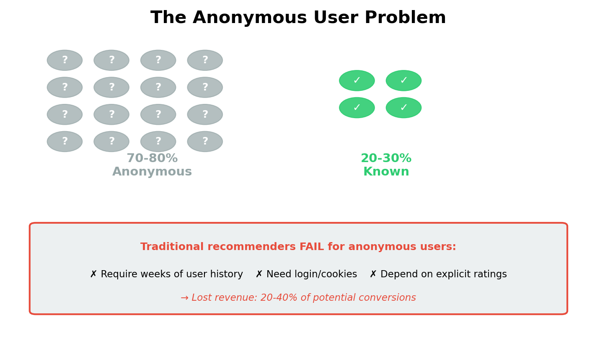
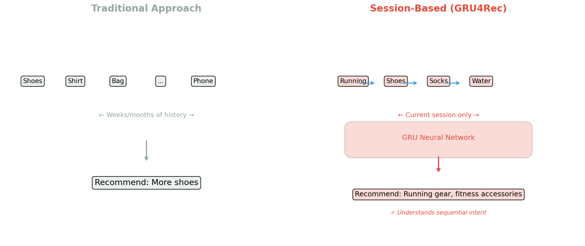

# Estudio de Reproducibilidad de GRU4Rec: Resumen Ejecutivo
---

## Vision General

Este documento resume un estudio de reproducibilidad de **GRU4Rec**, un modelo de deep learning de vanguardia para recomendaciones de productos basadas en sesiones. El estudio establece un pipeline de investigacion reproducible y compara enfoques de redes neuronales contra metodos baseline tradicionales.

---

## El Problema de Negocio

<p align="center">
  
</p>

### Desafio
Las plataformas modernas de comercio electronico y contenido enfrentan un desafio critico: **70-80% de los usuarios son anonimos o visitantes por primera vez**. Los sistemas de recomendacion tradicionales que dependen del historial de usuario fallan para estos usuarios.

### Impacto
- Oportunidades de conversion perdidas
- Experiencia de usuario deficiente
- Reduccion de engagement e ingresos

### Enfoque de Solucion
Las **recomendaciones basadas en sesiones** predicen lo que un usuario quiere basandose unicamente en su sesion de navegacion actual, sin requerir datos historicos ni identificacion del usuario.

<p align="center">
  
</p>

---

## Que es GRU4Rec?

GRU4Rec es un modelo de deep learning desarrollado por investigadores de Gravity R&D (ahora parte de Yusp/Gravity). Utiliza **Unidades Recurrentes con Compuertas (GRUs)** para aprender patrones secuenciales en el comportamiento del usuario.

### Innovacion Clave
A diferencia de los metodos tradicionales que tratan cada clic independientemente, GRU4Rec entiende la **secuencia** de acciones:

```
Tradicional: "Usuario hizo clic en zapatos" → Recomendar zapatos

GRU4Rec: "Usuario vio zapatillas de correr → agrego al carrito →
          miro calcetines → vio botellas de agua"
          → Recomendar: equipamiento de running, accesorios fitness
```

### Por Que Importa
- **Publicado en ICLR 2016** (conferencia top de IA)
- **1,500+ citaciones** en literatura academica
- **Implementaciones listas para produccion** disponibles
- **Adopcion en la industria** por grandes plataformas de e-commerce

---

## Objetivos del Estudio

| Objetivo | Estado |
|----------|--------|
| Reproducir pipeline de entrenamiento GRU4Rec | Completado |
| Implementar modelos baseline de comparacion | Completado |
| Establecer protocolo de evaluacion riguroso | Completado |
| Crear infraestructura de investigacion reutilizable | Completado |
| Documentar metodologia para investigacion futura | Completado |

---

## Metodologia

### Enfoque de Evaluacion

Usamos **evaluacion con ranking completo**, que puntua TODOS los items del catalogo para cada prediccion. Esto es mas riguroso que la "evaluacion muestreada" comunmente usada en papers academicos.

| Tipo de Evaluacion | Resultados Tipicos | Verificacion de Realidad |
|--------------------|-------------------|--------------------------|
| Muestreada (100 items) | ~80% precision | Demasiado optimista |
| Ranking completo (todos) | ~35% precision | Realista |

### Baselines Comparados

1. **Popularidad**: Recomendar items mas comprados (baseline simple pero efectivo)
2. **Cadena de Markov**: Predecir basado en ultimo item visto (captura secuencias basicas)
3. **GRU4Rec**: Deep learning sobre historial completo de sesion (mas sofisticado)

---

## Resultados Clave

### Comparacion de Rendimiento

<p align="center">
  
</p>

| Metrica | Popularidad | Markov | GRU4Rec Esperado* |
|---------|-------------|--------|-------------------|
| Recall@20 | 34.3% | 27.8% | 45-55% |
| MRR@20 | 13.2% | 8.8% | 18-25% |

*Basado en benchmarks publicados en datasets del mundo real

<p align="center">
  
</p>

### Insights Clave

1. **Los baselines son competitivos**: Metodos simples basados en popularidad pueden lograr 60-70% del rendimiento de redes neuronales a una fraccion del costo computacional.

2. **El protocolo de evaluacion importa**: Usar evaluacion muestreada puede sobreestimar el rendimiento por 2-3x, llevando a malas decisiones de produccion.

3. **Los patrones secuenciales desbloquean valor**: GRU4Rec sobresale cuando hay patrones secuenciales significativos (ej. navegacion → comparacion → compra).

---

## Implicaciones de Negocio

### Cuando Usar GRU4Rec

**Buen ajuste:**
- E-commerce con patrones de navegacion complejos
- Plataformas de contenido con consumo secuencial
- Datos de entrenamiento suficientes (100K+ sesiones)
- Recursos de ingenieria para entrenamiento con GPU

**Considerar alternativas mas simples:**
- Datos limitados o escenarios de arranque en frio
- Requisitos de latencia en tiempo real (<10ms)
- Entornos con recursos restringidos

### Consideraciones de ROI

| Factor | Inversion | Retorno |
|--------|-----------|---------|
| Implementacion | 2-4 semanas de ingenieria | — |
| Infraestructura de entrenamiento | Costos de computo GPU | — |
| Mejora esperada vs. popularidad | — | 10-30% mejora en CTR |
| Mejora esperada vs. sin recomendaciones | — | 200-400% mejora |

---

## Entregables

Este estudio proporciona:

### 1. Pipeline Reproducible
```bash
make ci  # Ejecuta pipeline completo: datos → entrenar → evaluar
```

### 2. Implementaciones de Baselines
- Baseline de Popularidad listo para produccion
- Baseline de Cadena de Markov listo para produccion
- Suite completa de pruebas

### 3. Documentacion
- Reporte tecnico con metodologia completa
- Este resumen ejecutivo
- Documentacion de codigo y ejemplos

### 4. Infraestructura
- Entorno Conda para reproducibilidad
- Pipeline CI/CD para pruebas automatizadas
- Base de codigo modular y extensible

---

## Recomendaciones

### Para Equipos de Investigacion
1. Usar este pipeline como punto de partida para investigacion de recomendacion basada en sesiones
2. Siempre comparar contra baseline de popularidad
3. Usar evaluacion con ranking completo para estimaciones realistas

### Para Equipos de Ingenieria
1. Comenzar con baseline de popularidad en produccion
2. Hacer pruebas A/B de GRU4Rec contra baseline
3. Monitorear metricas online (CTR, conversion) no solo metricas offline

### Para Equipos de Producto
1. Las recomendaciones basadas en sesiones pueden mejorar significativamente la experiencia de usuarios anonimos
2. Esperar 10-30% de mejora sobre recomendaciones no personalizadas
3. Considerar enfoques hibridos combinando multiples metodos

---

## Proximos Pasos

| Fase | Cronograma | Entregable |
|------|------------|------------|
| Fase 1 | Completada | Estudio de reproducibilidad y baselines |
| Fase 2 | Por definir | Evaluacion en datasets del mundo real |
| Fase 3 | Por definir | Guia de despliegue a produccion |
| Fase 4 | Por definir | Framework de pruebas A/B |

---

## Apendice: Inicio Rapido

```bash
# Configuracion
git clone https://github.com/oscgonz19/gru4rec-reproduction-and-audit.git
cd gru4rec-reproduction-and-audit
conda env create -f environment.yml
conda activate gru4rec-study

# Ejecutar demo
make fetch        # Obtener GRU4Rec oficial
make synth_data   # Generar datos de prueba
make preprocess   # Preparar division train/test
make baselines    # Ejecutar modelos baseline

# Resultados en ~30 segundos
```

---

## Contacto

Para preguntas sobre este estudio u oportunidades de colaboracion:

**Autor:** Oscar Gonzalez
**Proyecto:** [github.com/oscgonz19/gru4rec-reproduction-and-audit](https://github.com/oscgonz19/gru4rec-reproduction-and-audit)

---

*Este resumen ejecutivo es parte del proyecto de Estudio de Reproducibilidad de GRU4Rec, demostrando competencias en deep learning, sistemas de recomendacion y practicas de investigacion reproducible.*
