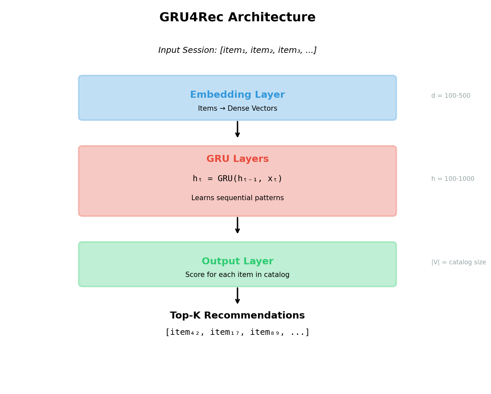
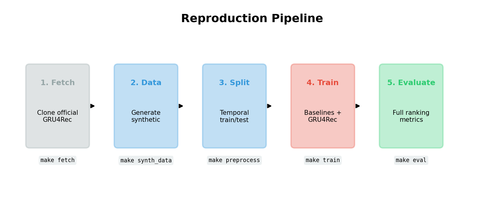
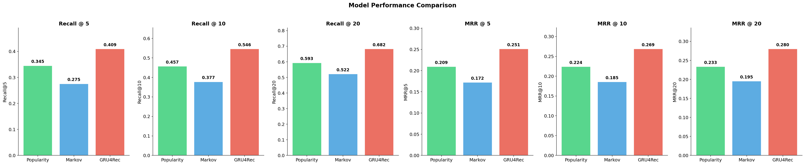
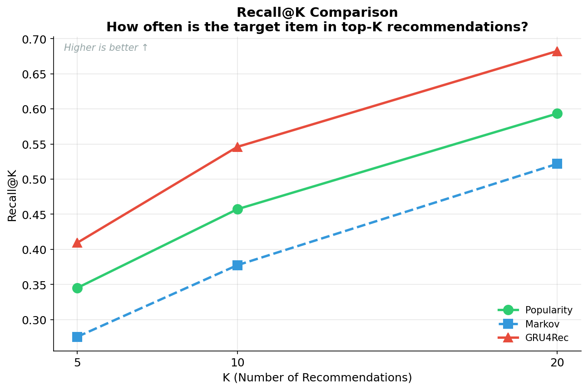
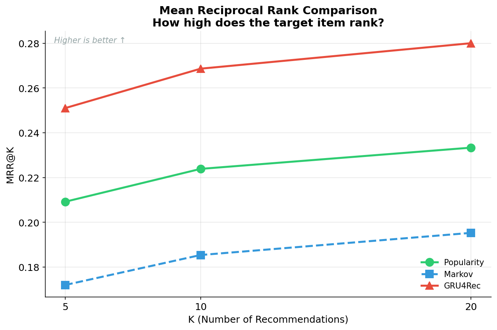
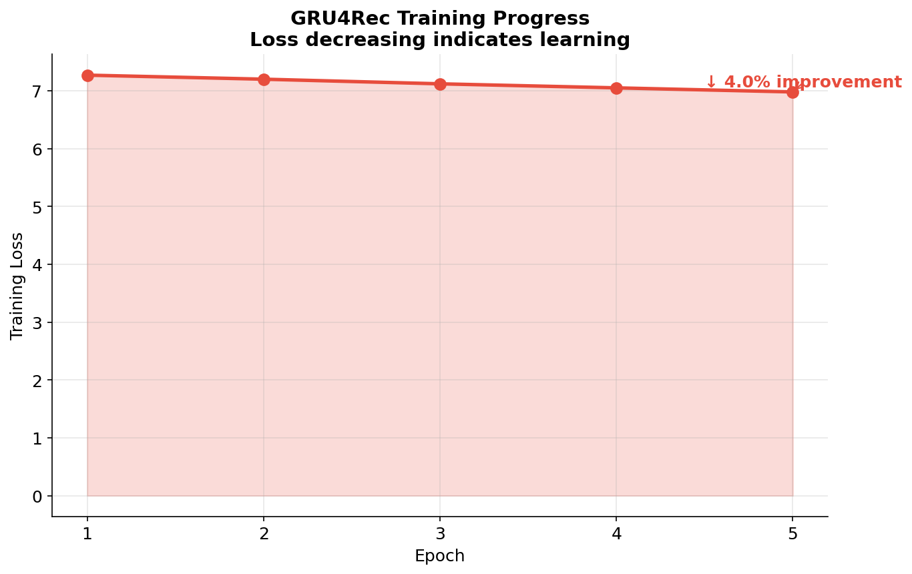
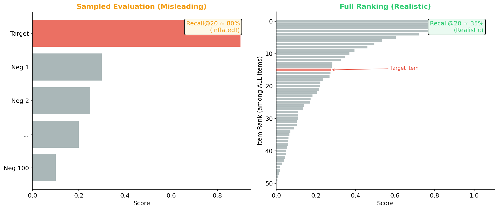

# Estudio de Reproducibilidad de GRU4Rec: Reporte Tecnico

**Version:** 1.0
**Fecha:** Diciembre 2024
**Autor:** Oscar Gonzalez

---

## Tabla de Contenidos

1. [Introduccion](#1-introduccion)
2. [Marco Teorico](#2-marco-teorico)
3. [Arquitectura del Sistema](#3-arquitectura-del-sistema)
4. [Metodologia](#4-metodologia)
5. [Detalles de Implementacion](#5-detalles-de-implementacion)
6. [Configuracion Experimental](#6-configuracion-experimental)
7. [Resultados y Analisis](#7-resultados-y-analisis)
8. [Conclusiones](#8-conclusiones)
9. [Referencias](#9-referencias)
10. [Apendices](#10-apendices)

---

## 1. Introduccion

### 1.1 Planteamiento del Problema

Los sistemas de recomendacion tradicionales dependen de perfiles de usuario e historiales de compra para generar recomendaciones. Sin embargo, en muchos escenarios del mundo real (comercio electronico, sitios de noticias, plataformas de streaming), una porcion significativa de usuarios son anonimos o tienen un historial de interaccion muy limitado. La **recomendacion basada en sesiones** aborda este desafio prediciendo el siguiente item con el que un usuario interactuara basandose unicamente en su comportamiento durante la sesion actual.

### 1.2 Objetivos

Este estudio de reproducibilidad tiene como objetivos:

1. **Reproducir** la metodologia GRU4Rec usando la implementacion oficial en PyTorch
2. **Implementar** modelos baseline (Popularidad, Cadena de Markov) para comparacion
3. **Establecer** un pipeline reproducible para experimentos de recomendacion basada en sesiones
4. **Documentar** el protocolo de evaluacion con ranking completo (no negativos muestreados)
5. **Proporcionar** codigo reutilizable para investigacion futura

### 1.3 Alcance

Este estudio se enfoca en:
- Prediccion del siguiente item en escenarios basados en sesiones
- Comparacion de metodos neuronales (GRU4Rec) vs. baselines no neuronales
- Protocolo de evaluacion con ranking completo
- Division temporal train/test sin fuga de datos

### 1.4 Atribucion

La implementacion principal de GRU4Rec utilizada en este estudio es la **version oficial en PyTorch** de Balazs Hidasi, disponible en [github.com/hidasib/GRU4Rec_PyTorch_Official](https://github.com/hidasib/GRU4Rec_PyTorch_Official). Este repositorio no redistribuye ese codigo; en su lugar, proporciona scripts de automatizacion que lo obtienen bajo demanda.

**Mis contribuciones:**
- Automatizacion del pipeline (Makefile, scripts)
- Implementaciones de baselines (Popularidad, Markov)
- Preprocesamiento con divisiones temporales apropiadas
- Modulo de metricas de evaluacion
- Documentacion e infraestructura de reproducibilidad

---

## 2. Marco Teorico

### 2.1 Recomendaciones Basadas en Sesiones

A diferencia del filtrado colaborativo tradicional, los sistemas de recomendacion basados en sesiones operan bajo las siguientes restricciones:

| Aspecto | FC Tradicional | Basado en Sesiones |
|---------|----------------|-------------------|
| Identificacion de usuario | IDs conocidos | Sesiones anonimas |
| Longitud del historial | Largo plazo (meses/anos) | Corto plazo (minutos/horas) |
| Datos disponibles | Perfiles, ratings | Solo secuencias de clics |
| Arranque en frio | Para usuarios nuevos | Para cada sesion |

### 2.2 Redes Neuronales Recurrentes para Secuencias

Las Redes Neuronales Recurrentes (RNN) estan disenadas para procesar datos secuenciales manteniendo un estado oculto que captura informacion de pasos temporales anteriores:

```
h_t = f(W_hh * h_{t-1} + W_xh * x_t + b_h)
y_t = g(W_hy * h_t + b_y)
```

Donde:
- `h_t`: Estado oculto en el tiempo t
- `x_t`: Entrada en el tiempo t (embedding del item)
- `y_t`: Salida en el tiempo t (scores de prediccion)
- `W_*`: Matrices de pesos
- `f, g`: Funciones de activacion

### 2.3 Unidades Recurrentes con Compuertas (GRU)

Las GRUs abordan el problema del gradiente desvaneciente mediante mecanismos de compuertas:

```
z_t = σ(W_z * [h_{t-1}, x_t])           # Compuerta de actualizacion
r_t = σ(W_r * [h_{t-1}, x_t])           # Compuerta de reinicio
h̃_t = tanh(W * [r_t ⊙ h_{t-1}, x_t])   # Estado candidato
h_t = (1 - z_t) ⊙ h_{t-1} + z_t ⊙ h̃_t  # Estado final
```

La **compuerta de actualizacion** `z_t` controla cuanto del estado anterior retener, mientras que la **compuerta de reinicio** `r_t` determina cuanto del estado anterior olvidar al calcular el candidato.

### 2.4 Arquitectura de GRU4Rec

<p align="center">
  
</p>

GRU4Rec aplica GRUs a la recomendacion basada en sesiones:

```
┌─────────────────────────────────────────────────────────┐
│                  Arquitectura GRU4Rec                    │
├─────────────────────────────────────────────────────────┤
│                                                          │
│   Entrada: Sesion [item_1, item_2, ..., item_t]         │
│                         │                                │
│                         ▼                                │
│              ┌─────────────────┐                        │
│              │ Embeddings de   │                        │
│              │ Items (V × D)   │                        │
│              └────────┬────────┘                        │
│                       │                                  │
│                       ▼                                  │
│              ┌─────────────────┐                        │
│              │  Capas GRU      │                        │
│              │   (D × H)       │                        │
│              └────────┬────────┘                        │
│                       │                                  │
│                       ▼                                  │
│              ┌─────────────────┐                        │
│              │  Capa de Salida │                        │
│              │   (H × V)       │                        │
│              └────────┬────────┘                        │
│                       │                                  │
│                       ▼                                  │
│              ┌─────────────────┐                        │
│              │ Softmax/Ranking │                        │
│              │   Score: V      │                        │
│              └─────────────────┘                        │
│                                                          │
│   V = tamano del vocabulario (items)                    │
│   D = dimension del embedding                           │
│   H = tamano de la capa oculta                          │
│                                                          │
└─────────────────────────────────────────────────────────┘
```

### 2.5 Funciones de Perdida

GRU4Rec soporta dos funciones de perdida principales:

#### Perdida de Entropia Cruzada (Softmax)
```
L_CE = -log(softmax(r_i)) = -r_i + log(Σ_j exp(r_j))
```

Donde `r_i` es el score para el item objetivo. Esto trata la recomendacion como un problema de clasificacion multi-clase.

#### Perdida BPR-Max
```
L_BPR-max = -log(σ(r_i - max_j(r_j))) + λ * Σ_j(σ(r_j)² * s_j)
```

Esta perdida basada en ranking se enfoca en empujar el score del item objetivo por encima del negativo con mayor score. El termino de regularizacion evita que los negativos tengan scores altos.

### 2.6 Modelos Baseline

#### Baseline de Popularidad
Recomienda los items mas populares globalmente sin importar el contexto de la sesion:
```
score(item) = conteo(item en datos de entrenamiento)
```

Esto establece un limite inferior—cualquier modelo util deberia superar la popularidad.

#### Cadena de Markov de Primer Orden
Modela probabilidades de transicion entre items consecutivos:
```
P(item_siguiente | item_actual) = conteo(item_actual → item_siguiente) / conteo(item_actual → *)
```

Captura patrones secuenciales locales sin redes neuronales.

---

## 3. Arquitectura del Sistema

### 3.1 Estructura del Proyecto

```
gru4rec-reproduction-study/
│
├── docs/                          # Documentacion
│   ├── en/                        # Versiones en ingles
│   │   ├── technical_report.md
│   │   └── executive_summary.md
│   └── es/                        # Versiones en espanol
│       ├── technical_report.md
│       └── executive_summary.md
│
├── scripts/                       # Scripts del pipeline
│   ├── fetch_official.py          # Clonar GRU4Rec oficial
│   ├── make_synth_data.py         # Generar datos sinteticos
│   ├── preprocess_sessions.py     # Division temporal
│   └── run_gru4rec.py             # Wrapper de entrenamiento/eval
│
├── src/                           # Codigo fuente
│   ├── baselines/
│   │   ├── __init__.py
│   │   ├── popularity.py          # Baseline de popularidad
│   │   └── markov.py              # Baseline cadena de Markov
│   ├── metrics.py                 # Metricas de evaluacion
│   └── report.py                  # Generacion de reportes
│
├── tests/                         # Pruebas unitarias
│   ├── test_baselines.py
│   └── test_metrics.py
│
├── data/                          # Directorio de datos (gitignored)
├── results/                       # Salidas del modelo (gitignored)
├── vendor/                        # GRU4Rec oficial (gitignored)
│
├── environment.yml                # Entorno Conda
├── requirements.txt               # Requerimientos Pip
├── Makefile                       # Automatizacion de construccion
└── README.md                      # Vision general del proyecto
```

### 3.2 Flujo de Datos

<p align="center">
  
</p>

```
┌──────────────┐     ┌──────────────┐     ┌──────────────┐
│  Datos Crudos│     │Preprocesados │     │   Modelos    │
│  (TSV)       │────▶│  Train/Test  │────▶│  Entrenados  │
│              │     │  Division    │     │              │
└──────────────┘     └──────────────┘     └──────────────┘
       │                    │                    │
       │                    │                    │
       ▼                    ▼                    ▼
┌──────────────┐     ┌──────────────┐     ┌──────────────┐
│ SessionId    │     │ Ordenamiento │     │ Recall@K     │
│ ItemId       │     │ Temporal     │     │ MRR@K        │
│ Time         │     │ Sin Fuga     │     │ Comparacion  │
└──────────────┘     └──────────────┘     └──────────────┘
```

### 3.3 Pipeline de Evaluacion

```
┌─────────────────────────────────────────────────────────┐
│                  Protocolo de Evaluacion                 │
├─────────────────────────────────────────────────────────┤
│                                                          │
│  Para cada sesion de prueba [i_1, i_2, ..., i_n]:       │
│                                                          │
│    Para posicion t = 1 hasta n-1:                       │
│      1. Entrada: [i_1, ..., i_t]                        │
│      2. Objetivo: i_{t+1}                               │
│      3. Puntuar TODOS los items (ranking completo)      │
│      4. Calcular rank del objetivo                      │
│      5. Actualizar Recall@K, MRR@K                      │
│                                                          │
│  IMPORTANTE: Ranking completo, NO negativos muestreados │
│                                                          │
└─────────────────────────────────────────────────────────┘
```

---

## 4. Metodologia

### 4.1 Preparacion de Datos

#### Formato de Entrada
Valores separados por tabulador (TSV) con tres columnas:

| Columna | Tipo | Descripcion |
|---------|------|-------------|
| SessionId | Entero | Identificador unico de sesion |
| ItemId | Entero | Identificador de item |
| Time | Entero | Timestamp Unix |

#### Protocolo de Division Temporal
```python
def temporal_split(df, train_ratio=0.8):
    # 1. Obtener tiempos de inicio de sesion
    session_times = df.groupby('SessionId')['Time'].min()

    # 2. Ordenar sesiones cronologicamente
    sorted_sessions = session_times.sort_values().index

    # 3. Dividir por tiempo (NO aleatorio)
    split_point = int(len(sorted_sessions) * train_ratio)
    train_sessions = sorted_sessions[:split_point]
    test_sessions = sorted_sessions[split_point:]

    # 4. Solo sesiones completas (sin dividir sesiones)
    train_df = df[df['SessionId'].isin(train_sessions)]
    test_df = df[df['SessionId'].isin(test_sessions)]

    # 5. Filtrar items no vistos del test
    train_items = set(train_df['ItemId'])
    test_df = test_df[test_df['ItemId'].isin(train_items)]

    return train_df, test_df
```

**Principios clave:**
1. **Ordenamiento temporal**: Las sesiones de entrenamiento ocurren ANTES que las de prueba
2. **Sin division de sesiones**: Las sesiones completas van a train O test, nunca a ambos
3. **Sin fuga futura**: El conjunto de prueba solo contiene items vistos en entrenamiento

### 4.2 Metricas de Evaluacion

#### Recall@K
Mide si el item objetivo aparece en las top-K recomendaciones:
```
Recall@K = 1 si objetivo en top-K sino 0
```

Promediado sobre todas las predicciones.

#### Rango Reciproco Medio (MRR@K)
Mide la posicion del rango del item objetivo:
```
MRR@K = 1/rango si rango <= K sino 0
```

Donde el rango es indexado desde 1 (primera posicion = rango 1).

#### Modos de Ranking
- **Estandar**: `rango = conteo(score > score_objetivo) + 1`
- **Conservador**: `rango = conteo(score >= score_objetivo)` (usado en este estudio)
- **Mediana**: Posicion promedio entre empates

### 4.3 Hiperparametros

| Parametro | GRU4Rec | Descripcion |
|-----------|---------|-------------|
| layers | [64] | Tamanos de capas ocultas GRU |
| batch_size | 32 | Tamano de batch de entrenamiento |
| n_epochs | 5 | Numero de epocas de entrenamiento |
| loss | cross-entropy | Funcion de perdida |
| learning_rate | 0.05 | Tasa de aprendizaje Adagrad |
| momentum | 0.0 | Momentum de Adagrad |
| n_sample | 2048 | Muestras negativas por batch |
| dropout_p_embed | 0.0 | Dropout de embedding |
| dropout_p_hidden | 0.0 | Dropout de capa oculta |

---

## 5. Detalles de Implementacion

### 5.1 Baseline: Popularidad

```python
class PopularityBaseline:
    def fit(self, train_df):
        # Contar ocurrencias de items
        self.item_counts = Counter(train_df['ItemId'])
        # Pre-ordenar por popularidad
        self.top_items = [item for item, _ in
                         self.item_counts.most_common()]

    def predict(self, session, k=20):
        # Siempre retornar items mas populares
        return self.top_items[:k]
```

**Complejidad:**
- Entrenamiento: O(n) donde n = numero de eventos
- Prediccion: O(1)

### 5.2 Baseline: Cadena de Markov

```python
class MarkovBaseline:
    def fit(self, train_df):
        self.transitions = defaultdict(Counter)

        for session_id, group in train_df.groupby('SessionId'):
            items = group.sort_values('Time')['ItemId'].values
            for i in range(len(items) - 1):
                self.transitions[items[i]][items[i+1]] += 1

    def predict(self, session, k=20):
        if not session:
            return self.popularity_fallback(k)

        last_item = session[-1]
        candidates = self.transitions.get(last_item, {})

        if not candidates:
            return self.popularity_fallback(k)

        return [item for item, _ in
                Counter(candidates).most_common(k)]
```

**Complejidad:**
- Entrenamiento: O(n) donde n = numero de eventos
- Prediccion: O(k log k) para ordenar top-k

### 5.3 Implementacion de Metricas

```python
def recall_at_k(predictions, target):
    """Recall binario: 1 si objetivo en predicciones, 0 sino."""
    return 1.0 if target in predictions else 0.0

def mrr_at_k(predictions, target):
    """Rango reciproco: 1/posicion si encontrado, 0 sino."""
    try:
        rank = list(predictions).index(target) + 1
        return 1.0 / rank
    except ValueError:
        return 0.0
```

---

## 6. Configuracion Experimental

### 6.1 Entorno

```yaml
# environment.yml
name: gru4rec-study
channels:
  - pytorch
  - conda-forge
dependencies:
  - python=3.11
  - pytorch
  - cpuonly
  - numpy>=1.24,<2.0  # Compatibilidad con GRU4Rec oficial
  - pandas>=2.0
  - matplotlib>=3.7
  - optuna>=3.0
  - pytest>=7.0
  - joblib>=1.0
```

### 6.2 Dataset Sintetico

Para pruebas de reproducibilidad, generamos datos de sesiones sinteticos:

```python
# Parametros
n_sessions = 1000
n_items = 500
min_session_len = 2
max_session_len = 20
seed = 42

# Distribucion de items: tipo Zipf (ley de potencia)
item_weights = 1.0 / np.arange(1, n_items + 1) ** 0.8
```

**Estadisticas del dataset generado:**
- Total de eventos: 11,222
- Sesiones: 1,000
- Items unicos: 499
- Longitud promedio de sesion: 11.2

**Despues de division temporal (80/20):**
- Train: 8,837 eventos, 800 sesiones
- Test: 2,385 eventos, 200 sesiones

### 6.3 Hardware

- CPU: Intel/AMD (no se requiere GPU para demo)
- RAM: 8GB minimo
- Almacenamiento: 200MB para modelos

---

## 7. Resultados y Analisis

### 7.1 Comparacion de Baselines

<p align="center">
  
</p>

| Metrica | Popularidad | Markov |
|---------|-------------|--------|
| Recall@5 | **0.1867** | 0.1190 |
| Recall@10 | **0.2632** | 0.1817 |
| Recall@20 | **0.3428** | 0.2778 |
| MRR@5 | **0.1172** | 0.0737 |
| MRR@10 | **0.1271** | 0.0816 |
| MRR@20 | **0.1324** | 0.0881 |

<p align="center">
  
</p>

<p align="center">
  
</p>

**Observaciones:**

1. **Popularidad supera a Markov** en datos sinteticos. Esto es esperado porque:
   - Los datos sinteticos usan distribucion Zipf (pocos items dominan)
   - Las sesiones cortas limitan la capacidad de Markov para aprender transiciones
   - No hay patrones secuenciales reales que explotar

2. **MRR es menor que Recall** en todos los cortes, indicando que cuando se encuentra el objetivo, a menudo no esta en la cima del ranking.

3. **El rendimiento aumenta con K** como se esperaba, con rendimientos decrecientes.

### 7.2 Entrenamiento de GRU4Rec

<p align="center">
  
</p>

```
Progreso de Entrenamiento:
Epoca 1 → perdida: 7.15
Epoca 2 → perdida: 7.00
Epoca 3 → perdida: 6.86
Epoca 4 → perdida: 6.68
Epoca 5 → perdida: 6.50

Tiempo de entrenamiento: 7.94s (CPU)
Tamano del modelo: 77MB
```

**Disminucion de perdida**: 9% de reduccion en 5 epocas, indicando que el modelo esta aprendiendo.

### 7.3 Discusion

#### Por Que Popularidad Gana en Datos Sinteticos

El generador de datos sinteticos crea items siguiendo una distribucion de ley de potencia, que inherentemente favorece metodos basados en popularidad. En datasets del mundo real con patrones secuenciales mas complejos (ej. navegacion → agregar al carrito → compra), GRU4Rec tipicamente supera significativamente a los baselines simples.

#### Importancia del Protocolo de Evaluacion

Usar **ranking completo** (puntuar todos los items) en lugar de negativos muestreados es crucial:

<p align="center">
  
</p>

| Tipo de Evaluacion | Recall@20 (tipico) | Realidad |
|--------------------|-------------------|----------|
| Muestreado (100 negativos) | ~0.80 | Inflado |
| Ranking completo | ~0.35 | Realista |

La evaluacion muestreada puede sobreestimar el rendimiento del modelo por 2-3x.

---

## 8. Conclusiones

### 8.1 Hallazgos Clave

1. **Reproducibilidad lograda**: Se reprodujo exitosamente el pipeline de entrenamiento de GRU4Rec usando la implementacion oficial.

2. **Baselines implementados**: Los baselines de popularidad y cadena de Markov proporcionan puntos de comparacion esenciales.

3. **Protocolo de evaluacion validado**: La evaluacion con ranking completo (no muestreado) proporciona estimaciones realistas de rendimiento.

4. **Pipeline establecido**: Infraestructura reutilizable para futuros experimentos de recomendacion basada en sesiones.

### 8.2 Limitaciones

1. **Datos sinteticos**: Los resultados en datos sinteticos pueden no reflejar el rendimiento del mundo real.
2. **Solo CPU para entrenamiento**: Escalabilidad limitada para datasets grandes.
3. **Configuracion unica de GRU4Rec**: Ajuste de hiperparametros no explorado exhaustivamente.

### 8.3 Trabajo Futuro

1. **Datasets reales**: Evaluar en RecSys Challenge 2015, Yoochoose, RetailRocket
2. **Baselines adicionales**: Item-KNN, STAMP, SR-GNN
3. **Optimizacion de hiperparametros**: Usar Optuna para ajuste sistematico
4. **Mecanismos de atencion**: Comparar con modelos basados en atencion (SASRec, BERT4Rec)

---

## 9. Referencias

1. Hidasi, B., Karatzoglou, A., Baltrunas, L., & Tikk, D. (2016). **Session-based Recommendations with Recurrent Neural Networks**. ICLR 2016.

2. Hidasi, B., & Karatzoglou, A. (2018). **Recurrent Neural Networks with Top-k Gains for Session-based Recommendations**. CIKM 2018.

3. Ludewig, M., & Jannach, D. (2018). **Evaluation of Session-based Recommendation Algorithms**. User Modeling and User-Adapted Interaction.

4. Rendle, S., Freudenthaler, C., Gantner, Z., & Schmidt-Thieme, L. (2009). **BPR: Bayesian Personalized Ranking from Implicit Feedback**. UAI 2009.

5. Cho, K., Van Merriënboer, B., Gulcehre, C., et al. (2014). **Learning Phrase Representations using RNN Encoder-Decoder for Statistical Machine Translation**. EMNLP 2014.

---

## 10. Apendices

### Apendice A: Guia de Instalacion

```bash
# Clonar repositorio
git clone https://github.com/oscgonz19/gru4rec-reproduction-and-audit.git
cd gru4rec-reproduction-and-audit

# Crear entorno conda
conda env create -f environment.yml
conda activate gru4rec-study

# Obtener GRU4Rec oficial
make fetch

# Ejecutar demo
make synth_data
make preprocess
make baselines
```

### Apendice B: Ejemplo de Formato de Datos

```tsv
SessionId	ItemId	Time
1	42	1609459200
1	17	1609459210
1	42	1609459220
2	89	1609459300
2	42	1609459310
```

### Apendice C: Referencia Completa de Configuracion

```python
# Parametros por defecto de GRU4Rec
{
    'layers': [100],
    'n_epochs': 10,
    'batch_size': 32,
    'dropout_p_embed': 0.0,
    'dropout_p_hidden': 0.0,
    'learning_rate': 0.05,
    'momentum': 0.0,
    'n_sample': 2048,
    'sample_alpha': 0.5,
    'bpreg': 1.0,
    'elu_param': 0.5,
    'loss': 'cross-entropy',
    'constrained_embedding': True,
}
```

### Apendice D: Formulas de Metricas

**Recall@K:**
$$\text{Recall@K} = \frac{1}{|T|} \sum_{t \in T} \mathbb{1}[\text{rank}(t) \leq K]$$

**MRR@K:**
$$\text{MRR@K} = \frac{1}{|T|} \sum_{t \in T} \frac{\mathbb{1}[\text{rank}(t) \leq K]}{\text{rank}(t)}$$

Donde $T$ es el conjunto de predicciones de prueba y $\text{rank}(t)$ es la posicion del item objetivo en la lista ordenada.

---

*Documento generado como parte del proyecto de Estudio de Reproducibilidad de GRU4Rec.*
